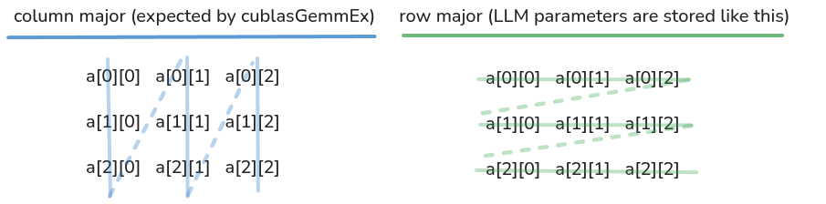

# 🔄 The column-major to row-major transposition trick

**TL;DR: if your data is in row-major format and you're going to use cuBLAS, then set transposition flag to `CUBLAS_OP_T` for matrices that are not tranposed yet, and `CUBLAS_OP_N` to matrices that are transposed in your formula**

Now the derivation and understanding:

The problem with cublasGemmEx is that it expects you to provide the matrices in [column-major format](https://en.wikipedia.org/wiki/Row-_and_column-major_order). And the LLMs, like Llama 3.2 1B Instruct, are distributed in row-major format.



It turns out we don't have to modify the data format to use cuBLAS matrix multiplication functions. All thanks to these properties:

$$[A^T]_{ij}=[A]_{ji} \qquad C^T=B^T \times A^T \qquad (A^T)^T=A$$

The "$^T$" means that we transpose the matrix. Transposing a matrix turns columns into rows, and rows into columns. When you store the matrix in row-major format, and cuBLAS reads it in column-major format, it's an equivalent of transposing the matrix.

Let's see an example to understand it better: we want to compute $C = A \times B$, where A has dimensions (5, 2048) and B has dimensions (512, 2048). Our desired dimension of C is (5, 512). Right now, A and B dimensions are incompatible: $A(5, 2048)$ and $B(512, 2048)$. Do you remember that to get $C(M,N)$ we need $A(M,K)$ and $B(K,N)$? In other words, the second dimension of A and first dimension of B need to be equal. To achieve that, we need to transpose B. The formula becomes now: $C = A \times B^T$. The dimensions are ok now: $A(5,2048) \times B(2048, 512) = C(5, 512)$. Okay, so we would like to use cuBLAS now to compute the C.

But cuBLAS expects column-major format of A and B. Row-major transposed will give us column-major. So let's transpose the formula $C = A \times B^T$, using the property $C^T=B^T \times A^T$ and we get $C^T = (B^T)^T \times A^T$. From the third property of the matrix above, we know that a transposition of a transposition is equal to the original matrix, so we simplify $(B^T)^T$ to just $B$. The final formula is: $C^T = B \times A^T$. Let's check if dimensions are still correct. $B (512, 2048) \times A^T(2048, 5) = C^T(512, 5)$. The result dimensions seem inverse of what we wanted to get -- (5, 512) -- but notice that we still talk about $C^T$. The actual $C$, the output of the cublasGemmEx, is not transposed, so the final dimension is correct (5, 512). Now the code:

```cpp
cublasGemmEx(cublas_handle, CUBLAS_OP_T, CUBLAS_OP_N, KV_DIM, num_active_slots, EMBEDDING_LENGTH, &k_proj_alpha, weights.w_k[layer], CUDA_R_16BF, EMBEDDING_LENGTH, rms_norms, CUDA_R_16BF, EMBEDDING_LENGTH, &k_proj_beta, k_proj_batched_buffer, CUDA_R_16BF, KV_DIM, CUBLAS_COMPUTE_32F, CUBLAS_GEMM_DEFAULT);
```

I want to preempt the last confusion you might have if you actually dig into the code. The flags `CUBLAS_OP_T` and `CUBLAS_OP_N` tell the cuBLAS which matrices to transpose. And we just derived the formula $C^T=B \times A^T$, so why do we now tell the cuBLAS to transpose the first matrix $B$? To understand it, think about column- / row-major again. From cuBLAS perspective, our row-major $B$ is transposed $B^T$, because cuBLAS reads it as if it were column-major. So we need to tell cuBLAS to transpose it, to get back the $B$ we derived. Similarly, since we derived that the second argument should be $A^T$, and cuBLAS reads row-major $A$ as a column-major $A^T$, then don't transpose it again, because it's how we wanted to provide it to the cublasGemmEx. Q.E.D. :D

> I will publish this section in slightly different form in [Paged Out! Issue #9 in the article "The cuBLAS transposition trick"](https://pagedout.institute/)

---

[← cublasGemmEx](13-cublasgemmex.md) · [🏠 Index](../README.md) · [Prefill vs decode →](15-prefill-vs-decode.md)
